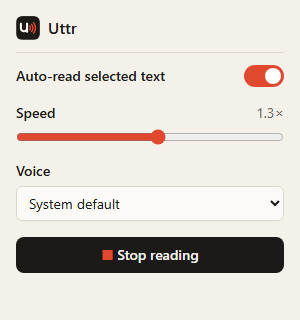
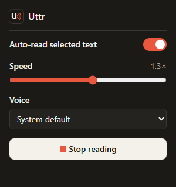

<p align="center">
  
</p>

<h1 align="center">Uttr</h1>

<p align="center">
  <strong>Select text. Hear it.</strong><br>
  A lightweight Chrome extension that reads any text aloud the moment you highlight it.
</p>

<p align="center">
  
  
  
  
</p>

---

## Table of contents

1. [Overview](#overview)
2. [Screenshots](#screenshots)
3. [Features](#features)
4. [Installation](#installation)
5. [Usage](#usage)
6. [Project structure](#project-structure)
7. [How it works](#how-it-works)
8. [File-by-file walkthrough](#file-by-file-walkthrough)
9. [The chunking algorithm](#the-chunking-algorithm)
10. [Edge cases handled](#edge-cases-handled)
11. [Design decisions](#design-decisions)
12. [Permissions and privacy](#permissions-and-privacy)
13. [Visual design](#visual-design)
14. [Testing](#testing)
15. [Troubleshooting](#troubleshooting)
16. [Browser support](#browser-support)
17. [Known limitations](#known-limitations)
18. [Future improvements](#future-improvements)
19. [What I learned](#what-i-learned)

---

## Overview

Reading long articles on a screen is tiring, and most text-to-speech tools make you copy text into another app or click a button every time. **Uttr removes those steps.** Highlight text on any webpage with your mouse and it's spoken aloud straight away, in the voice and at the speed you choose.

- **Zero friction:** there's no button to press and no copy-pasting. Select the text and it's read.
- **Private by design:** speech is generated by your browser's built-in [Web Speech API](https://developer.mozilla.org/en-US/docs/Web/API/SpeechSynthesis). Uttr has no servers, collects no analytics and makes no network requests of its own.
- **Tiny and dependency-free:** plain JavaScript, HTML and CSS, with no framework and no build step. Every file is commented so it's easy to learn from.

Built as a portfolio project to learn Chrome extension development with **Manifest V3**.

## Screenshots

<p align="center">
  
  &nbsp;&nbsp;
  
  <br>
  <em>The settings popup in light mode (left) and dark mode (right). It follows your operating system's theme.</em>
</p>

## Features

### Auto-read on selection
Select text with the mouse and Uttr reads it aloud about **300 ms** after you release the button. The short delay lets double-click (word) and triple-click (paragraph) selections finish before reading starts.

### New selection interrupts
If Uttr is already reading and you select something else, the current speech stops immediately and the new text starts. You never have to wait for the previous passage to finish.

### Stop anytime
- Press **Escape** on the page.
- Click **Stop reading** in the popup.
- Switch auto-read **off** in the popup, which also silences anything playing.

### Settings popup
Click the Uttr icon in the toolbar to open it:

| Control | What it does | Default |
|---|---|---|
| **Auto-read toggle** | Turns automatic reading on or off without uninstalling | On |
| **Speed slider** | Speech rate from **0.5×** (slow) to **2×** (fast), in 0.1 steps | 1.0× |
| **Voice picker** | Every voice available on your system, grouped by language | System default |
| **Stop reading** | Stops speech in the current tab | n/a |

### Settings are saved
Settings are stored with `chrome.storage.sync`, so they:
- survive closing and reopening Chrome
- sync across computers where you're signed in to Chrome
- apply **instantly** to every open tab, with no page refresh needed

### Handles long text
Chrome can stop partway through long passages. Uttr splits text into sentence-sized chunks and queues them, so whole articles are read to the end. See [the chunking algorithm](#the-chunking-algorithm).

### Ignores accidental selections
Empty selections, whitespace, single characters, right-clicks and unchanged selections are all ignored. See [edge cases handled](#edge-cases-handled).

## Installation

Uttr isn't on the Chrome Web Store yet, so you install it as an **unpacked extension**. This takes about a minute.

1. **Get the code**
   ```bash
   git clone https://github.com/ajayalle10/uttr.git
   ```
   Or click **Code → Download ZIP** on GitHub and unzip it.

2. **Open the extensions page:** go to `chrome://extensions` in Chrome.

3. **Enable Developer mode:** turn on the toggle in the top-right corner.

4. **Load the extension:** click **Load unpacked** and select the `uttr` folder, the one that contains `manifest.json`.

5. **Pin it (optional):** click the puzzle-piece icon in the toolbar, then the pin next to **Uttr**.

6. **Refresh open tabs:** Chrome only injects the extension into pages loaded *after* installation, so reload any tabs that were already open.

### Updating after changing the code
1. Click the **↻ reload** button on the Uttr card in `chrome://extensions`.
2. Refresh the webpage you're testing on.

## Usage

| I want to… | Do this |
|---|---|
| Read some text | Select it with the mouse |
| Read something else instead | Just select the new text; the old speech stops |
| Stop reading | Press `Esc`, or open the popup and click **Stop reading** |
| Read slower or faster | Open the popup and drag the **Speed** slider |
| Change the voice | Open the popup and pick from **Voice** |
| Pause Uttr on a page with lots of selecting | Open the popup and switch **Auto-read** off |
| Re-read the same passage | Click elsewhere to clear the selection, then select it again |

> **Tip:** voices named "Google …" usually sound the most natural but need an internet connection. The others are installed on your operating system and work offline.

## Project structure

```
uttr/
├── manifest.json        Extension configuration: name, permissions, scripts, popup, icons
├── defaults.js          Default settings, shared by the content script and the popup
├── content.js           Runs on every webpage: detects selections, splits text, speaks
├── popup/
│   ├── popup.html       Markup for the settings panel
│   ├── popup.css        Styles for the settings panel (brand colours, light and dark mode)
│   └── popup.js         Loads/saves settings, lists voices, sends the "stop" message
├── icons/
│   ├── icon16.png       Toolbar icon
│   ├── icon48.png       Extensions page and popup header
│   └── icon128.png      Install dialog and Web Store
├── docs/                Images used in this README
└── README.md
```

## How it works

A Chrome extension is made of several parts that run in **separate places** and can't share variables directly. Uttr has two:

- **The content script** (`content.js`) runs inside every webpage. It can see what you select and it does the speaking.
- **The popup** (`popup/`) is a small, separate webpage that exists only while it's open.

They communicate in two ways: through **shared storage** for settings, and through **messages** for the Stop button.

```
 WEBPAGE (content.js)                             POPUP (popup.js)
 ════════════════════                             ════════════════

 mouse released                                   toggle / slider / voice changed
      │                                                     │
      ▼                                                     ▼
 wait 300 ms (let double/triple-click finish)     chrome.storage.sync.set(...)
      │                                                     │
      ▼                                                     │
 read window.getSelection()                                 │
      │                                                     │
      ▼                                                     │
 filters: empty? too short? same as last?                   │
      │                                                     │  storage.onChanged
      ▼                                                     │  (fires in EVERY tab)
 split text into chunks  ◄──── current settings ◄───────────┘
      │
      ▼
 speechSynthesis.cancel()  (stop the old speech)
 speechSynthesis.speak() × N chunks  ◄──── stop ◄──── "Stop reading" clicked
      │                                                chrome.tabs.sendMessage(tab, {type: "stop"})
      ▼
 🔊 audio
```

### Lifecycle of one selection
1. You drag across a sentence and release the mouse, which fires the **`mouseup`** event.
2. Uttr checks that auto-read is on and that it was the **left** button, then starts a **300 ms timer**. Another mouseup during that time restarts the timer.
3. When the timer fires, Uttr reads `window.getSelection().toString().trim()`.
4. The text goes through the [filters](#edge-cases-handled). If it's empty, too short or already read, nothing happens.
5. The text is split into chunks sized for the current speed.
6. `speechSynthesis.cancel()` clears anything already playing, then each chunk is queued with `speechSynthesis.speak()`, using your chosen voice and speed.
7. The browser plays the queue in order until it's done, or until you press Escape, click Stop or select something new.

## File-by-file walkthrough

### `manifest.json`
The first file Chrome reads. It declares:

| Key | Purpose |
|---|---|
| `manifest_version: 3` | Uses the current extension platform. Manifest V2 is retired. |
| `permissions: ["storage"]` | The **only** permission, needed for `chrome.storage.sync`. |
| `action.default_popup` | The HTML page shown when the toolbar icon is clicked. |
| `content_scripts` | Injects `defaults.js` then `content.js` into every page (`<all_urls>`) once it has loaded (`document_idle`). |
| `icons` | Icons at 16, 48 and 128 px for the different places Chrome shows them. |

### `defaults.js`
One frozen object, `DEFAULT_SETTINGS = { enabled, rate, voiceURI }`. Both the content script and the popup load this file, so the defaults live in **one place** and can't drift apart. `chrome.storage.sync.get(DEFAULT_SETTINGS)` then means "give me the saved values, and use these defaults for anything never saved".

### `content.js`
The core of the extension, organised into sections:

| Section | Responsibility |
|---|---|
| **Constants** | `SELECTION_DELAY_MS` (300), `MIN_SELECTION_LENGTH` (2), `BASE_MAX_CHUNK_LENGTH` (150) |
| **State** | Current `settings`, the pending `selectionTimer`, and `lastSpokenText` for the "don't repeat" rule |
| **Settings** | Loads saved settings at startup and listens to `chrome.storage.onChanged` so popup changes apply instantly. Turning auto-read off also calls `stopSpeaking()`. |
| **Text chunking** | `splitIntoChunks()`, `breakLongSentence()`, `hardSplitWord()`, `packPieces()`, `getMaxChunkLength()` |
| **Speaking** | `speak()` builds one `SpeechSynthesisUtterance` per chunk with the chosen rate and voice. `stopSpeaking()` cancels speech and any pending timer. |
| **Selection handling** | The `mouseup`, `selectionchange` and `keydown` (Escape) listeners |
| **Messages** | `chrome.runtime.onMessage` handles `{ type: "stop" }` from the popup and replies so the popup knows it arrived |

### `popup/popup.html`
A small form: a toggle, a range slider with a live `<output>` value, a `<select>` for voices, a Stop button and a status line. Manifest V3 **forbids inline scripts**, so the page loads `../defaults.js` and `popup.js` as separate files.

### `popup/popup.js`
- **Startup:** reads settings and fills in the controls.
- **Voices:** `speechSynthesis.getVoices()` often returns an empty list at first because Chrome loads voices asynchronously. `populateVoices()` therefore runs at startup **and** on the `voiceschanged` event. Voices are sorted by language, then name, and stored by `voiceURI`, their unique ID. If the saved voice has been uninstalled, the dropdown falls back to "System default".
- **Saving:** each control saves only its own key, for example `save({ rate: 1.5 })`.
- **The slider uses two events:** `input` fires continuously while dragging and only updates the label. `change` fires once on release and saves. This keeps within the write limits of `chrome.storage.sync`.
- **Stop:** finds the active tab with `chrome.tabs.query` and sends it a message. If no content script answers (for example on `chrome://` pages), it shows a friendly note instead of failing silently.

### `popup/popup.css`
All colours are **CSS custom properties** on `:root`, redefined inside `@media (prefers-color-scheme: dark)`. The rules below only ever use the variables, so the whole popup changes theme without duplicated rules. The toggle switch is a real `<input type="checkbox">` restyled with `appearance: none`. That keeps it accessible to keyboard and screen-reader users. It's drawn with a `::before` knob.

## The chunking algorithm

**The problem:** Chrome can silently stop speaking partway through a long utterance, after roughly 15 seconds with the online "Google" voices. Handing it a whole article in one utterance means it may simply stop.

**The solution:** break text into chunks short enough to finish within that window, and queue them. The browser plays queued utterances back to back.

`splitIntoChunks(text, maxLength)` works in stages:

| Stage | What happens | Why |
|---|---|---|
| **0. Clean** | Runs of spaces, tabs and newlines become single spaces | Selected text contains layout line breaks |
| **1. Sentences** | [`Intl.Segmenter`](https://developer.mozilla.org/en-US/docs/Web/JavaScript/Reference/Global_Objects/Intl/Segmenter) with `granularity: "sentence"` | Language-aware, so it handles "Dr.", "e.g." and "3.5" better than splitting on `.` |
| **2. Clauses** | A sentence that's still too long is split after `, ; :` using the lookbehind regex `/(?<=[,;:])\s+/` | Natural pause points; the punctuation stays with its clause |
| **3. Words** | A clause that's still too long is split at spaces | Fallback for run-on text |
| **4. Hard split** | A single "word" longer than the limit, such as a giant URL, is sliced | Guarantees every piece fits |
| **5. Pack** | Pieces are greedily joined back together up to the limit | Avoids a robotic pause after every short sentence |

**Speed-aware limit:** at slower speeds each character takes longer to say, so the chunk limit shrinks:

| Speed | Max chunk length |
|---|---|
| 0.5× | 75 characters |
| 0.75× | 113 characters |
| 1× and faster | 150 characters |

**Example** (at 1×):

> *The quick brown fox jumps over the lazy dog. Dr. Smith arrived at 3 p.m. on Monday! Was it raining? Nobody knows, e.g. the weather report was missing. Then again, it did not matter much to anyone involved in the story.*

becomes two utterances:
1. `The quick brown fox jumps over the lazy dog. Dr. Smith arrived at 3 p.m. on Monday! Was it raining? Nobody knows, e.g. the weather report was missing.` (150 chars)
2. `Then again, it did not matter much to anyone involved in the story.` (67 chars)

## Edge cases handled

| Situation | Behaviour | How |
|---|---|---|
| Empty or whitespace-only selection | Ignored | `.trim()` reduces it to `""` |
| Selection under 2 characters (e.g. a stray click on "a") | Ignored | `MIN_SELECTION_LENGTH` |
| Clicking somewhere that leaves the selection in place | Not re-read | Compared against `lastSpokenText` |
| Deliberately re-selecting the same text | **Is** re-read | `selectionchange` clears `lastSpokenText` when the selection is cleared |
| Double- or triple-click selections | Reads the final word or paragraph | 300 ms delay, restarted on each mouseup |
| Right-click on a selection (e.g. to copy) | Ignored | Only `event.button === 0` counts |
| New selection while speaking | Old speech stops, new speech starts | `speechSynthesis.cancel()` before speaking |
| Escape pressed while speaking | Stops | Capture-phase `keydown` listener |
| Escape pressed within 300 ms of selecting | Reading is cancelled before it starts | Pending timer is cleared |
| Escape pressed when nothing is playing | Ignored; the page handles it normally | Only acts when `speaking` or `pending` |
| Very long text | Read to the end | [Chunking](#the-chunking-algorithm) |
| Extremely long "words" (URLs) | Read without breaking the queue | Hard split |
| Auto-read switched off mid-speech | Speech stops | `storage.onChanged` calls `stopSpeaking()` |
| Saved voice later uninstalled | Falls back to the default voice | Voice lookup returns `null` and the popup shows "System default" |
| Stop clicked on a page where extensions can't run | Friendly message in the popup | `sendMessage` rejection is caught |

## Design decisions

- **Why a 300 ms delay?** Double- and triple-clicks keep expanding the selection for a moment. Reading immediately would read half a selection, or read twice.
- **Why is Escape registered in the capture phase?** Events travel *down* the page to the focused element and then bubble back *up*. Some sites stop key events on the way up. A capture-phase listener runs first, so Escape always works. Uttr doesn't call `preventDefault()`, so the page still receives Escape too, and dialogs still close.
- **Why is there no background service worker?** Many extensions have one, but Uttr doesn't need it. Settings reach every tab through `storage.onChanged`, and the popup talks to the active tab directly. Fewer moving parts means fewer bugs.
- **Why store the voice by `voiceURI`?** Voice objects can't be saved. `voiceURI` is the stable, unique identifier for a voice, so it can be stored and looked up again later.
- **Why save the slider on `change` rather than `input`?** `chrome.storage.sync` limits how many writes you can make per minute and per hour. Saving on every pixel of a drag could exceed those limits.
- **Why share `defaults.js`?** A single source of truth. If the defaults change, they change everywhere.

## Permissions and privacy

| Permission | Why it's needed |
|---|---|
| `storage` | Saves your three settings (on/off, speed, voice) |

That's all. In particular:

- **No `tabs`, `history` or host permissions** beyond the content script itself.
- **No network requests.** Uttr sends nothing anywhere. The only exception is the "Google" voices, which Chrome itself may stream from Google's speech service, exactly as it would for any website that uses the Web Speech API.
- **No data collection, analytics or tracking.** Selected text is passed straight to the browser's speech engine and never stored.

## Visual design

The popup uses the colours of the Uttr logo:

| Token | Colour | Used for |
|---|---|---|
| Ink | `#1B1A17` | Text and the Stop button (light mode), background (dark mode) |
| Cream | `#F4F1EA` | Background (light mode), text and the Stop button (dark mode) |
| Red | `#E0492F` | Toggle, slider and the ■ stop icon; the "sound waves" of the logo |

- **Dark mode** flips ink and cream automatically based on your OS setting, and uses a slightly lighter red (`#E8573E`) so it stands out on the dark background.
- **Accessibility:** every text/background pair meets **WCAG AA** contrast (body text 15.4:1, muted text 5.0:1 in light and 6.9:1 in dark mode). Interactive elements meet the 3:1 contrast required for UI elements, and every control has a visible keyboard focus ring.

## Testing

Uttr is tested manually against this checklist. Reload the extension and refresh the test page first.

**Core reading**
- [ ] Selecting a sentence reads it aloud.
- [ ] Selecting new text while speaking interrupts and reads the new text.
- [ ] 3–4 paragraphs are read to the end without cutting off.

**Stopping**
- [ ] `Esc` stops speech mid-sentence.
- [ ] `Esc` pressed immediately after selecting prevents reading.
- [ ] `Esc` with nothing playing doesn't interfere with the page.
- [ ] Popup **Stop reading** stops speech.
- [ ] On `chrome://extensions`, **Stop reading** shows "Uttr isn't running on this page".

**Filters**
- [ ] Double-clicking a single letter ("a") is ignored.
- [ ] Selecting only blank space is ignored.
- [ ] Right-clicking a selection doesn't re-read it.
- [ ] Clearing the selection and re-selecting the same text reads it again.

**Settings**
- [ ] Toggle off, then select: nothing is read. Toggle on: it's read again.
- [ ] Toggling off mid-speech silences it.
- [ ] 2.0× is noticeably fast and 0.5× noticeably slow, and long text at 0.5× isn't cut off.
- [ ] Choosing a voice changes the voice on the next selection.
- [ ] After fully restarting Chrome, the popup still shows the saved settings.

## Troubleshooting

| Problem | Fix |
|---|---|
| Nothing is read on a page | Refresh the page. Extensions only load into pages opened after install or reload. |
| Nothing is read on `chrome://…` pages, the Chrome Web Store or PDFs | Expected: Chrome blocks extensions there. |
| The popup says "Uttr isn't running on this page" | Same as above, or the tab needs refreshing. |
| The voice list is empty | Close and reopen the popup; Chrome sometimes loads voices late. |
| Speech cuts off partway | Try a non-Google (offline) voice; if it persists, please open an issue with the text. |
| Code changes don't show up | Click **↻** on the Uttr card in `chrome://extensions`, then refresh the page. |
| Errors | Open DevTools on the page (F12 → Console), or click **Errors** on the Uttr card in `chrome://extensions`. |

## Browser support

| Browser | Status |
|---|---|
| Google Chrome 88+ | ✅ Supported (Manifest V3 and `Intl.Segmenter`) |
| Microsoft Edge, Brave, Opera, other Chromium browsers | ✅ Should work; load the extension the same way |
| Firefox, Safari | ❌ Not yet: they use different extension packaging |

## Known limitations

- Chrome doesn't allow extensions on `chrome://` pages, the Chrome Web Store or the built-in PDF viewer.
- Only **mouse** selections trigger reading, not keyboard selections (`Shift` + arrows).
- Text inside **iframes** (some embedded content) isn't detected.
- Changing speed or voice applies to the **next** selection, not to speech already playing.
- The available voices depend on your operating system; "Google" voices need an internet connection.

## Future improvements

- [ ] **Translate-then-read:** translate the selection into a chosen language before speaking.
- [ ] **Word-by-word highlighting:** highlight each word as it's spoken, using the utterance `boundary` event.
- [ ] **Neural / AI voices:** optional higher-quality cloud voices.
- [ ] **Desktop app version (Python):** read selected text in any application, not just the browser.
- [ ] **Global keyboard shortcuts** with the `chrome.commands` API, for example `Alt+Shift+S` to stop from anywhere in Chrome.
- [ ] **Pause / resume** controls in the popup.
- [ ] **Keyboard selection support** and reading inside iframes.
- [ ] **Per-site on/off:** disable auto-read on specific websites.
- [ ] **Live settings:** apply speed and voice changes to speech that's already playing.
- [ ] **Chrome Web Store release.**

## What I learned

- **How Manifest V3 extensions are structured:** content scripts vs. extension pages, and why they're isolated from each other.
- **Messaging between parts:** `chrome.storage.onChanged` for broadcasting state, and `chrome.tabs.sendMessage` / `chrome.runtime.onMessage` for direct commands.
- **Working around real browser bugs:** designing the chunking algorithm for Chrome's long-utterance cut-off.
- **Event-handling details:** debouncing with timers, capture vs. bubble phase, and `input` vs. `change` events.
- **Asynchronous browser APIs**, such as voices that load late.
- **Building for users:** handling accidental input, failing gracefully, and meeting accessibility contrast standards in both themes.

---

<p align="center">
  Built by <a href="https://github.com/ajayalle10">@ajayalle10</a>
</p>
